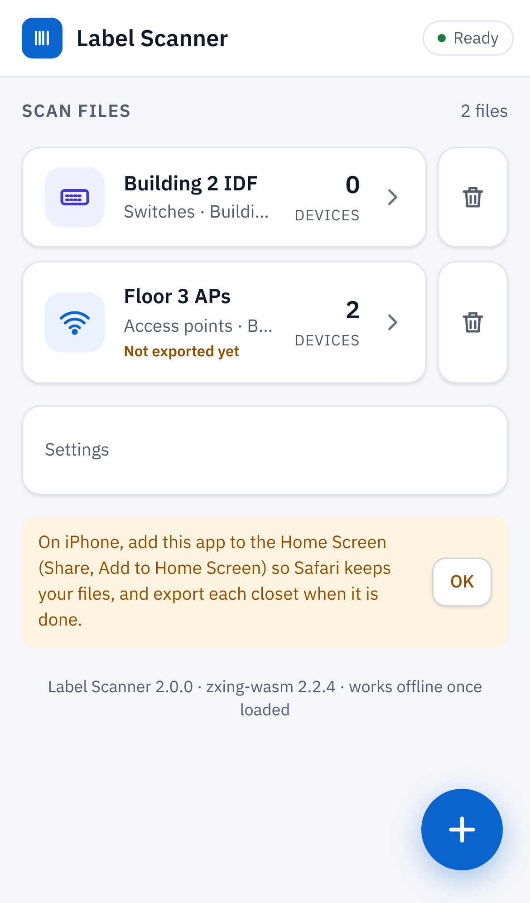
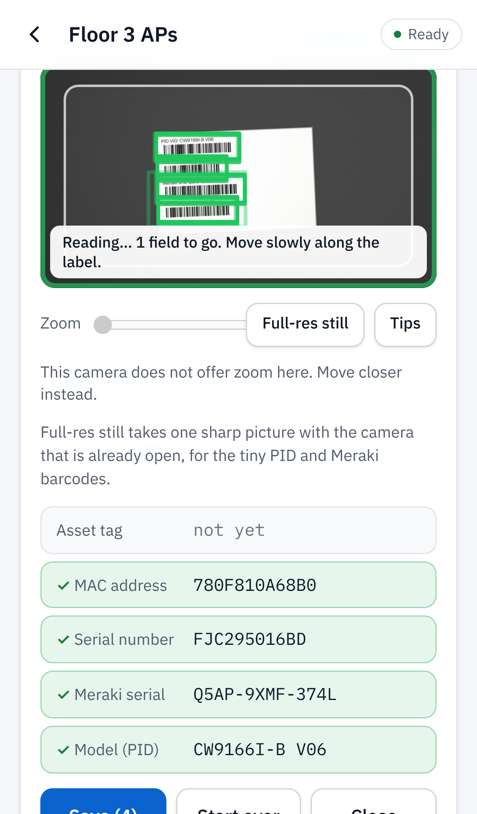
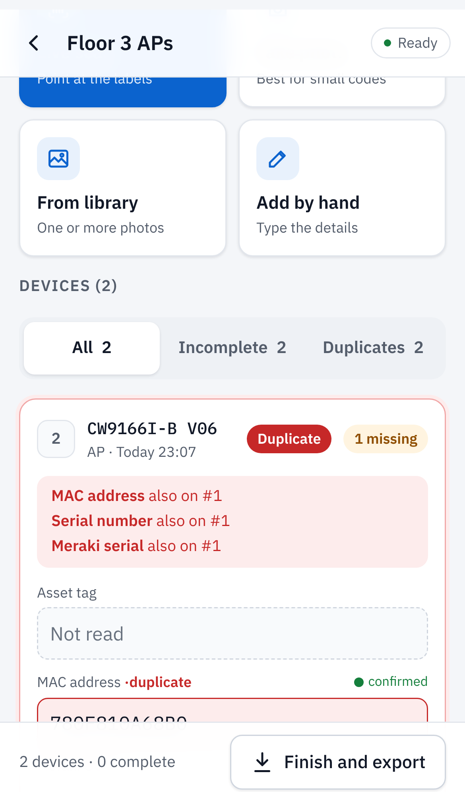
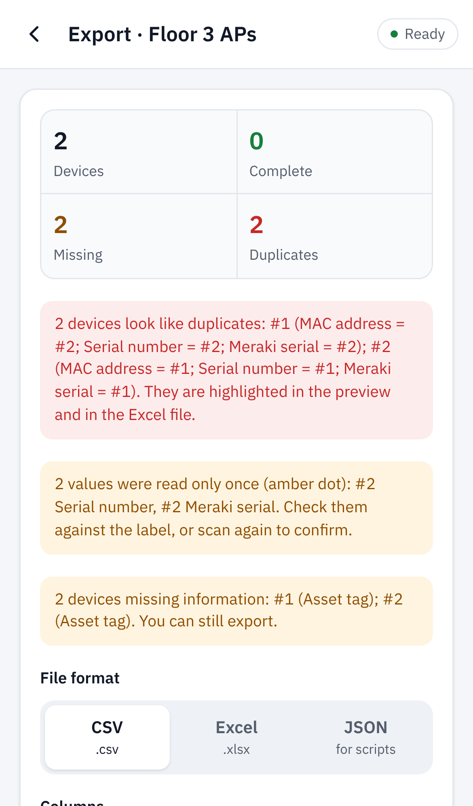

# Label Scanner

Phone web app that reads the barcodes on Cisco switch and Cisco/Meraki access point labels and exports them as CSV, Excel or JSON.
It is a static site with no build step, no server and no accounts. It installs to the home screen and works offline once loaded.

<p>




</p>

The screenshots come from desktop Chromium in an iPhone 13 viewport fed by a synthetic camera (`node scripts/screenshots.mjs`), not from a real phone.

## Privacy

- Camera frames and photos are decoded in memory, then discarded. Nothing is uploaded, and no image is ever stored.
- No analytics or telemetry. The app makes no third-party requests at runtime: the decoder (zxing-wasm), the fonts (IBM Plex) and the Cisco/Meraki OUI list are all served from this site. An end-to-end test fails if any request leaves the origin.
- Scanned values (asset tag, MAC, serial and so on) stay in the browser's own storage (IndexedDB) on that phone until you delete them, using **Delete this file** or **Settings > Delete all data**.
- Export happens only when you tap **Finish and export**. Files leave the phone only when you choose share, download or copy.

## Put it on GitHub Pages

1. Push this repository to GitHub.
2. Open **Settings > Pages**. Under **Build and deployment > Source**, choose **GitHub Actions**. The CI workflow (`.github/workflows/ci.yml`) runs every test on each push. On `main` it then publishes the `site/` folder.
3. After the first green run on `main`, the app is at `https://<user>.github.io/<repo>/`. The workflow publishes `site/` as the site root.
4. On the iPhone, open that address in Safari and tap **Share > Add to Home Screen**. Safari then keeps the app's data much longer than it does for a plain tab, and the app opens full screen.

The camera needs `https://`, which Pages provides. Opening `index.html` from the Files app will not work.

Other hosts work too, because the app is just the `site/` folder. `vercel.json` and `wrangler.toml` (Cloudflare Pages) already point at `site/`. Hosts that serve the whole repository reach the app through the root `index.html`, which redirects to `site/`.

## Using it

- **Home** lists your scan files. Each file is its own data set: devices are numbered from #1, and duplicates are checked only inside that file. Tap **+** to start a file. Give it a name, an optional Location and Rack/U, and choose **Access points**, **Switches** or **Different devices**.
- **Live scan**: point at one device's labels. Boxes outline each barcode as it is read. A field shows an amber dot when read once and turns green with a tick when two reads agree. **Save** stores the device and clears the boxes for the next one. **Auto-save in live scan** (Settings, off by default) does this on its own once every field is confirmed.
- **Take photo / Full-res still**: one full-resolution picture. Better for the tiny PID and Meraki barcodes. Video input is not supported, by design.
- **Repeat scans**: if a scan matches a device already in the file (serial, Meraki serial or MAC), the app asks whether to **Open existing**, which merges the new values in, or **Add as new**, which adds a flagged duplicate.
- **Device cards** show per-field confidence (confirmed / read once / typed) and checks: serial date codes, OUI vendor, hardware revision, and serial vs. Meraki mismatches. A card also offers **Scan asset tag**, **Add photo**, merge into another device, and delete with undo.
- **Finish and export** shows a summary of duplicates, values read only once, and missing fields, then a preview. Choose:
  - **Format**: CSV, Excel (.xlsx) or JSON
  - **Template**: *All fields* or *Asset tag, MAC, serial* (the two original CSV layouts, unchanged), *Snipe-IT import*, or your own
  - **MAC format** and the **file name**, which defaults to `label-scan_<file>_<YYYY-MM-DD>`

  Then **Email or share**, **Download**, or **Copy as table**. A file shows *Not exported yet* on Home until it is exported. Cells that start with `= + - @` are escaped, so a spreadsheet cannot run them as formulas.
- **Scan quality tips** (Settings, or **Tips** in live scan) gives one-line fixes for glare, rack lighting, curved labels and tiny codes.

## Supported labels

| Label | Fields |
|---|---|
| Cisco Catalyst switch (e.g. C9300, C9200) | Asset tag, MAC, serial, PID + hardware rev, part number, CLEI (Data Matrix) |
| Cisco/Meraki AP (e.g. CW9166I, CW9172) | Asset tag, MAC, Cisco serial, Meraki serial, PID + hardware rev |
| Anything else (*Different devices*) | Asset tag, MAC, serial and any other codes, under Note |

Symbologies: Code 128, Code 39, Data Matrix and QR. Native `BarcodeDetector` is used as an accelerator where the browser has it, and zxing-wasm always runs, so Safari works. The asset tag pattern defaults to 4 to 9 digits and can be changed under **Settings**.

## Known limits

Tested only in **desktop Chromium** (Playwright, iPhone 13 viewport, with a fake camera playing synthetic 1080p label video) and in Node:

- live-scan read and confirm times, and no main-thread long tasks over 50 ms on the AP feed
- photo decoding (golden images)
- offline load, the update banner, storage surviving a reload, and the export templates
- axe WCAG 2.1 AA checks in light and dark themes
- no horizontal scroll at 360 px

**Not yet verified on a real iPhone.** `docs/device-test-checklist.md` lists what to check:

- Safari camera behavior: permission prompts in the home-screen app, zoom and torch support, tap-to-focus, the camera resuming after the app is backgrounded
- real label photos in rack lighting. All test images are synthetic: real symbols rendered on a mock label, then tilted, blurred and compressed.
- the share sheet attaching files
- how long Safari keeps IndexedDB data
- whether 1080p live frames are sharp enough for the smallest PID and Meraki codes on your devices. On a real phone, plan to use Full-res still for those.

Also:

- The **Snipe-IT** preset uses the importer's common header names (`Asset Tag, Serial Number, Model Name, MAC Address, Location, Notes`). It has not been checked against a live Snipe-IT instance. Snipe-IT lets you remap headers on import.
- iOS has no `BarcodeDetector`, so the iPhone always decodes with zxing-wasm in a worker.
- Very large files (thousands of devices) have not been timed. The export preview renders every row.

## Project layout

- `site/`: the app. This folder is what gets published.
  - `index.html`, `app.js`: layout and UI
  - `sw.js`, `manifest.webmanifest`, `icons/`: offline support and install. `npm run sw` refreshes the precache list and the BUILD hash after any change in `site/`. A unit test fails if the hash is stale.
  - `src/`: ES modules
    - `camera.js`, `scanner.js`, `worker.js` (decoder worker), `live.js` (live pipeline, sharpness gate)
    - `scan.js`, `regions.js`, `deskew.js`, `image.js` (photo pipeline)
    - `classify.js`, `device.js`, `validate.js` (field rules, merge, checks)
    - `templates.js`, `csv.js`, `xlsx.js` (export), `store.js` (IndexedDB)
  - `vendor/zxing-wasm/`: [zxing-wasm](https://github.com/Sec-ant/zxing-wasm) **2.2.4**, reader ES module build (MIT, see `vendor/LICENSE-zxing-wasm.txt`). wasm SHA-256 `85d46f55d7c86a4d09bb04273367408b19c324f582d040d018aecb25a9a82942`. Refresh it with `node scripts/vendor.mjs`.
  - `fonts/`: IBM Plex Sans and Mono, Latin subset (SIL OFL 1.1)
  - `data/oui-cisco.json`: Cisco and Meraki OUIs from the IEEE registry (`oui-data` 2.1.35, `node scripts/make-oui.mjs`)
- `test/`
  - `unit/`: Node unit tests
  - `golden/`: golden tests on photos and video frames
  - `e2e/`: Playwright tests
  - `fixtures/`: test images (`*.jpg`) and ground truth (`expected.json`)
- `scripts/`: fixture and video generators, the static dev server, vendoring, service worker build, screenshots
- `docs/`: screenshots and the device test checklist

## Development

```bash
npm ci
npm run fixtures:video   # synthetic camera feeds for the live tests (needs ffmpeg, python3 numpy + pillow)
npm test                 # unit + golden tests in Node with the real zxing-wasm decoder
npx playwright install chromium
npm run test:e2e         # Playwright: Chromium with a fake camera, iPhone 13 viewport
npm run serve            # http://localhost:8765/
```

To test against real images, replace `test/fixtures/ap.jpg` and `switch.jpg` with real phone photos of the same labels. `expected.json` stays the same.

## License

MIT, see `LICENSE`. Bundled third-party code and fonts keep their own licenses: zxing-wasm (MIT) and IBM Plex (SIL OFL 1.1).
